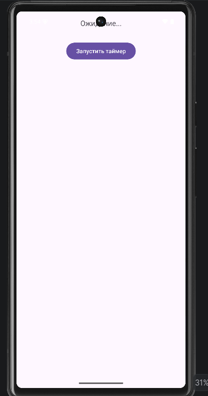
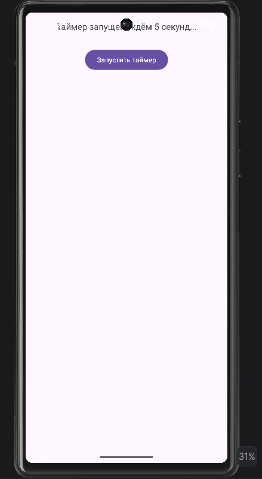
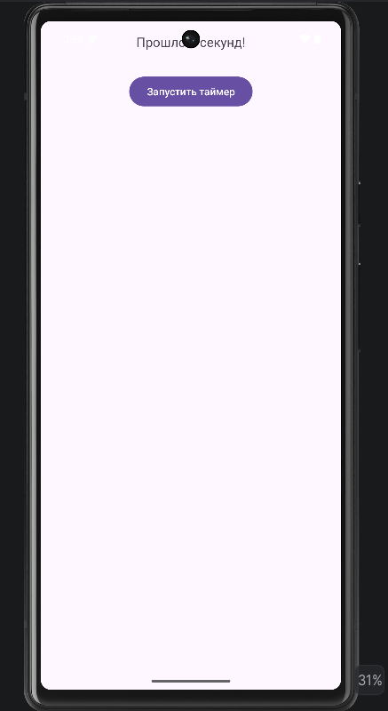
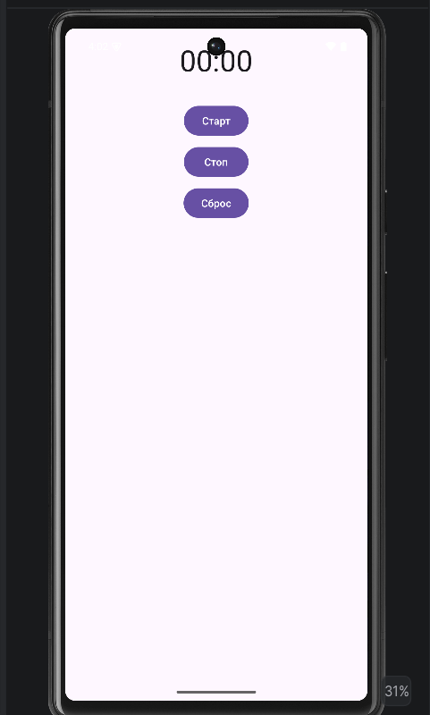
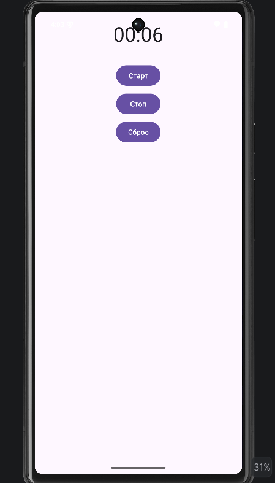
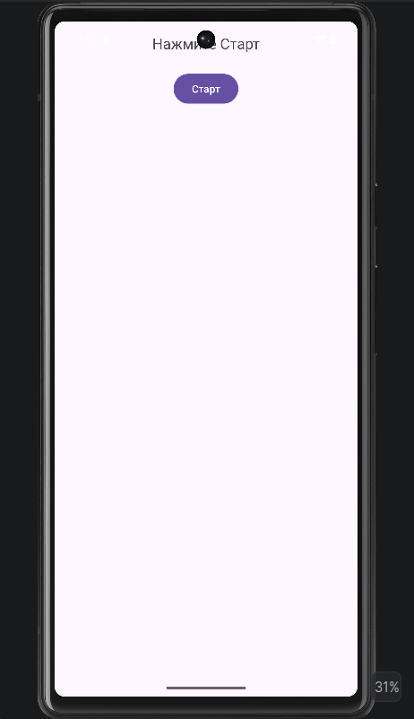
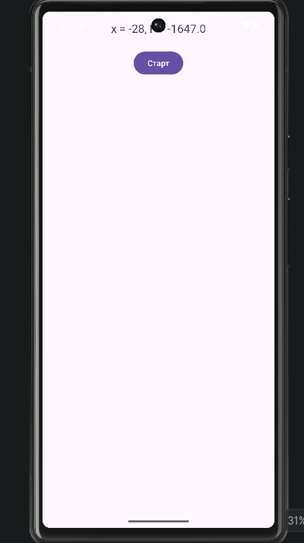
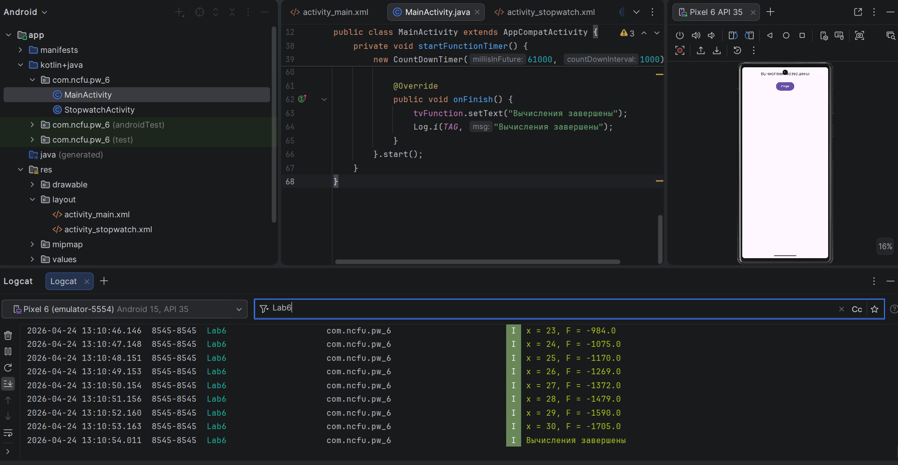

<div align="center">

# Отчёт

</div>

<div align="center">

## Практическая работа №6

</div>

<div align="center">

## Отладка приложений. Использование Logcat и таймеров

</div>

**Выполнил:**  
Ткачев Сергей Юрьевич  
**Курс:** 2  
**Группа:** ИНС-б-о-24-2  
**Направление:** ИПИНЖ (Институт перспективной инженерии)  
**Профиль:** Информационные системы и технологии  

---

### Цель работы

Изучить инструменты отладки Android-приложений. Научиться использовать `Logcat` для логирования сообщений различных уровней, а также применять таймеры (`Timer`, `Chronometer`) для выполнения отсроченных и периодических задач.

### Ход работы

#### Задание 1: Знакомство с Logcat

1. В Android Studio был создан новый проект с шаблоном **Empty Views Activity**. Проекту было дано имя `DebuggingLab`.
2. В методе `onCreate()` были добавлены сообщения с разными уровнями логирования.
3. Также была искусственно создана ошибка деления на ноль, которая была обработана через `try-catch` и выведена в `Logcat`.

#### Листинг 1. Код для `MainActivity.java`

```java
package com.ncfu.pw_6;

import android.os.Bundle;
import android.util.Log;

import androidx.appcompat.app.AppCompatActivity;

public class MainActivity extends AppCompatActivity {

    private static final String TAG = "MainActivity";

    @Override
    protected void onCreate(Bundle savedInstanceState) {
        super.onCreate(savedInstanceState);
        setContentView(R.layout.activity_main);

        Log.v(TAG, "Verbose: детальная отладочная информация");
        Log.d(TAG, "Debug: отладочное сообщение");
        Log.i(TAG, "Info: приложение запущено");
        Log.w(TAG, "Warning: это предупреждение");
        Log.e(TAG, "Error: искусственная ошибка");

        try {
            int result = 10 / 0;
        } catch (ArithmeticException e) {
            Log.e(TAG, "Ошибка арифметики", e);
        }
    }
}
```

4. После запуска приложения было открыто окно `Logcat` (`View` → `Tool Windows` → `Logcat`).
5. Были найдены сообщения разных уровней, проверена фильтрация:
- по уровню логирования;
- по тегу `MainActivity`;
- по тексту сообщения.

<div align="center">


*Рисунок 1. Вывод сообщений в Logcat*

</div>

<div align="center">


*Рисунок 2. Фильтрация по тегу*

</div>

<div align="center">


*Рисунок 3. Поиск сообщения в Logcat*

</div>

---

#### Задание 2: Использование точек останова (Breakpoints)

1. Была установлена точка останова на строке:

```java
Log.d(TAG, "Debug: отладочное сообщение");
```

2. Приложение было запущено в режиме отладки.
3. После остановки выполнения была использована панель `Debugger`:
- команда **Step Over** (`F8`);
- просмотр значений в окне **Variables**;
- команда **Resume Program** (`F9`) для продолжения выполнения программы.

<div align="center">


*Рисунок 4. Точка останова в коде*

</div>

<div align="center">


*Рисунок 5. Работа в режиме отладки*

</div>

---

#### Задание 3: Работа с Timer (отложенное выполнение)

1. В файл `activity_main.xml` были добавлены `TextView` с `id="tvTimer"` для вывода результата и кнопка для запуска таймера.

#### Листинг 2. Содержимое `activity_main.xml`

```xml
<?xml version="1.0" encoding="utf-8"?>
<LinearLayout xmlns:android="http://schemas.android.com/apk/res/android"
    android:layout_width="match_parent"
    android:layout_height="match_parent"
    android:orientation="vertical"
    android:padding="16dp">

    <TextView
        android:id="@+id/tvTimer"
        android:layout_width="wrap_content"
        android:layout_height="wrap_content"
        android:text="Ожидание..."
        android:textSize="18sp"
        android:layout_gravity="center_horizontal"
        android:layout_marginBottom="32dp" />

    <Button
        android:id="@+id/btnStartTimer"
        android:layout_width="wrap_content"
        android:layout_height="wrap_content"
        android:text="Запустить таймер"
        android:layout_gravity="center_horizontal" />

</LinearLayout>
```

2. В `MainActivity.java` был реализован запуск таймера, который через 5 секунд изменяет текст в `TextView`.

#### Листинг 3. Код `MainActivity.java` для Timer

```java
package com.ncfu.pw_6;

import android.os.Bundle;
import android.util.Log;
import android.view.View;
import android.widget.Button;
import android.widget.TextView;

import androidx.appcompat.app.AppCompatActivity;

import java.util.Timer;
import java.util.TimerTask;

public class MainActivity extends AppCompatActivity {

    private static final String TAG = "MainActivity";
    private TextView tvTimer;
    private Button btnStartTimer;

    @Override
    protected void onCreate(Bundle savedInstanceState) {
        super.onCreate(savedInstanceState);
        setContentView(R.layout.activity_main);

        tvTimer = findViewById(R.id.tvTimer);
        btnStartTimer = findViewById(R.id.btnStartTimer);

        btnStartTimer.setOnClickListener(new View.OnClickListener() {
            @Override
            public void onClick(View v) {
                startDelayedTask();
            }
        });
    }

    private void startDelayedTask() {
        tvTimer.setText("Таймер запущен, ждём 5 секунд...");
        Timer timer = new Timer();
        TimerTask task = new TimerTask() {
            @Override
            public void run() {
                runOnUiThread(new Runnable() {
                    @Override
                    public void run() {
                        tvTimer.setText("Прошло 5 секунд!");
                        Log.i(TAG, "Таймер сработал");
                    }
                });
            }
        };
        timer.schedule(task, 5000);
    }
}
```

3. После запуска приложения при нажатии на кнопку запускался таймер, и через 5 секунд текст на экране изменялся.

<div align="center">



*Рисунок 6. Начальное состояние экрана*

</div>

<div align="center">



*Рисунок 7. Сообщение о запуске таймера*

</div>

<div align="center">



*Рисунок 8. Изменение текста после 5 секунд*

</div>

---

#### Задание 4: Создание секундомера с Chronometer

1. В проект была добавлена новая `Empty Views Activity` с именем `StopwatchActivity`.
2. В файле `activity_stopwatch.xml` был создан интерфейс секундомера.
3. В `MainActivity` была добавлена кнопка для перехода к экрану секундомера.
4. В `StopwatchActivity.java` была реализована логика запуска, остановки и сброса секундомера.

#### Листинг 4. Содержимое `activity_stopwatch.xml`

```xml
<?xml version="1.0" encoding="utf-8"?>
<LinearLayout xmlns:android="http://schemas.android.com/apk/res/android"
    android:layout_width="match_parent"
    android:layout_height="match_parent"
    android:orientation="vertical"
    android:gravity="center_horizontal"
    android:padding="16dp">

    <Chronometer
        android:id="@+id/chronometer"
        android:layout_width="wrap_content"
        android:layout_height="wrap_content"
        android:textSize="40sp"
        android:layout_marginBottom="32dp" />

    <Button
        android:id="@+id/btnStart"
        android:layout_width="wrap_content"
        android:layout_height="wrap_content"
        android:text="Старт" />

    <Button
        android:id="@+id/btnStop"
        android:layout_width="wrap_content"
        android:layout_height="wrap_content"
        android:text="Стоп"
        android:layout_marginTop="8dp" />

    <Button
        android:id="@+id/btnReset"
        android:layout_width="wrap_content"
        android:layout_height="wrap_content"
        android:text="Сброс"
        android:layout_marginTop="8dp" />

</LinearLayout>
```

#### Листинг 5. Содержимое `StopwatchActivity.java`

```java
package com.ncfu.pw_6;

import android.os.Bundle;
import android.os.SystemClock;
import android.view.View;
import android.widget.Button;
import android.widget.Chronometer;

import androidx.appcompat.app.AppCompatActivity;

public class StopwatchActivity extends AppCompatActivity {

    private Chronometer chronometer;
    private Button btnStart, btnStop, btnReset;
    private boolean isRunning = false;

    @Override
    protected void onCreate(Bundle savedInstanceState) {
        super.onCreate(savedInstanceState);
        setContentView(R.layout.activity_stopwatch);

        chronometer = findViewById(R.id.chronometer);
        btnStart = findViewById(R.id.btnStart);
        btnStop = findViewById(R.id.btnStop);
        btnReset = findViewById(R.id.btnReset);

        chronometer.setBase(SystemClock.elapsedRealtime());

        btnStart.setOnClickListener(new View.OnClickListener() {
            @Override
            public void onClick(View v) {
                if (!isRunning) {
                    chronometer.start();
                    isRunning = true;
                }
            }
        });

        btnStop.setOnClickListener(new View.OnClickListener() {
            @Override
            public void onClick(View v) {
                if (isRunning) {
                    chronometer.stop();
                    isRunning = false;
                }
            }
        });

        btnReset.setOnClickListener(new View.OnClickListener() {
            @Override
            public void onClick(View v) {
                chronometer.setBase(SystemClock.elapsedRealtime());
            }
        });
    }
}
```

<div align="center">



*Рисунок 9. Экран секундомера*

</div>

<div align="center">



*Рисунок 10. Отсчёт времени в Chronometer*

</div>

---

#### Задания для самостоятельного выполнения

**Вариант 5.** Требовалось использовать `Timer` или `CountDownTimer` для выполнения периодических вычислений с шагом **1 секунда**, выводить промежуточные значения в `Logcat` с тегом **"Lab6"**, а также отображать текущее значение на экране.

По условию варианта необходимо было вычислять функцию:

\[
F =
\begin{cases}
ax^2 + bx + c, & \text{при } a < 0 \text{ и } c \ne 0 \\
-a/(x-c), & \text{при } a > 0 \text{ и } c = 0 \\
a(x+c), & \text{в остальных случаях}
\end{cases}
\]

при изменении `x` от `-30` до `30` с шагом `1` в секунду.

Для реализации были выбраны параметры:
- `a = -2`
- `b = 3`
- `c = 5`

Так как `a < 0` и `c != 0`, во всех вычислениях использовалась первая ветвь формулы:

\[
F = ax^2 + bx + c
\]

---

1. В `activity_main.xml` были добавлены:
- `TextView` для отображения текущего значения `x` и результата функции;
- кнопка **«Старт»** для запуска вычислений.

#### Листинг 6. Разметка `activity_main.xml` для самостоятельного задания

```xml
<?xml version="1.0" encoding="utf-8"?>
<LinearLayout xmlns:android="http://schemas.android.com/apk/res/android"
    android:layout_width="match_parent"
    android:layout_height="match_parent"
    android:orientation="vertical"
    android:padding="16dp"
    android:gravity="center_horizontal">

    <TextView
        android:id="@+id/tvFunction"
        android:layout_width="wrap_content"
        android:layout_height="wrap_content"
        android:text="Нажмите Старт"
        android:textSize="20sp"
        android:layout_marginBottom="24dp" />

    <Button
        android:id="@+id/btnStart"
        android:layout_width="wrap_content"
        android:layout_height="wrap_content"
        android:text="Старт" />

</LinearLayout>
```

2. В `MainActivity.java` была реализована логика периодического вычисления функции через `CountDownTimer`.  
Каждую секунду значение `x` увеличивалось на 1, вычислялось значение функции `F`, результат отображался на экране и записывался в `Logcat` с тегом `"Lab6"`.

#### Листинг 7. Код `MainActivity.java` для варианта 5

```java
package com.ncfu.pw_6;

import android.os.Bundle;
import android.os.CountDownTimer;
import android.util.Log;
import android.view.View;
import android.widget.Button;
import android.widget.TextView;

import androidx.appcompat.app.AppCompatActivity;

public class MainActivity extends AppCompatActivity {

    private static final String TAG = "Lab6";
    private TextView tvFunction;
    private Button btnStart;

    private final double a = -2;
    private final double b = 3;
    private final double c = 5;

    @Override
    protected void onCreate(Bundle savedInstanceState) {
        super.onCreate(savedInstanceState);
        setContentView(R.layout.activity_main);

        tvFunction = findViewById(R.id.tvFunction);
        btnStart = findViewById(R.id.btnStart);

        btnStart.setOnClickListener(new View.OnClickListener() {
            @Override
            public void onClick(View v) {
                startFunctionTimer();
            }
        });
    }

    private void startFunctionTimer() {
        new CountDownTimer(61000, 1000) {
            int x = -30;

            @Override
            public void onTick(long millisUntilFinished) {
                double f;

                if (a < 0 && c != 0) {
                    f = a * x * x + b * x + c;
                } else if (a > 0 && c == 0) {
                    f = -a / (x - c);
                } else {
                    f = a * (x + c);
                }

                String result = "x = " + x + ", F = " + f;
                tvFunction.setText(result);
                Log.i(TAG, result);

                x++;
            }

            @Override
            public void onFinish() {
                tvFunction.setText("Вычисления завершены");
                Log.i(TAG, "Вычисления завершены");
            }
        }.start();
    }
}
```

3. После запуска приложения и нажатия на кнопку **«Старт»** началось пошаговое вычисление функции.  
Значения отображались на экране и одновременно выводились в `Logcat`.

<div align="center">



*Рисунок 11. Начальное состояние приложения*

</div>

<div align="center">



*Рисунок 12. Отображение текущего значения функции*

</div>

<div align="center">



*Рисунок 13. Вывод результатов в Logcat*

</div>

### Вывод

В результате выполнения практической работы были изучены инструменты отладки Android-приложений. Были получены навыки использования `Logcat` для логирования сообщений различных уровней, применения точек останова в процессе отладки, а также использования `Timer`, `CountDownTimer` и `Chronometer` для выполнения отсроченных и периодических задач. В самостоятельной части была реализована программа для пошагового вычисления функции по заданной формуле с выводом результатов на экран и в `Logcat`. Таким образом, цель практической работы была достигнута.

### Ответы на контрольные вопросы

1. **Какие уровни логирования существуют в Android? Для каких целей используется каждый из них?**  

   В Android используются следующие основные уровни логирования:
   - `Log.v()` (`Verbose`) — максимально подробная диагностическая информация;
   - `Log.d()` (`Debug`) — отладочные сообщения, полезные во время разработки;
   - `Log.i()` (`Info`) — информационные сообщения о нормальной работе приложения;
   - `Log.w()` (`Warning`) — предупреждения о возможных проблемах;
   - `Log.e()` (`Error`) — сообщения об ошибках и исключениях.

2. **Как открыть окно Logcat в Android Studio? Как отфильтровать сообщения только по тегу и только по уровню Error?**  

   Окно `Logcat` открывается через меню:  
   `View` → `Tool Windows` → `Logcat`.

   Для фильтрации:
   - по тегу можно использовать поиск по тегу, например `tag:MainActivity`;
   - по уровню `Error` выбирается фильтр уровня логирования `Error` в интерфейсе `Logcat`.

3. **В чем разница между методами `Log.e()` и `Log.w()`? Приведите примеры использования.**  

   Метод `Log.e()` используется для вывода ошибок, то есть ситуаций, когда в приложении произошло что-то неправильное или аварийное.  
   Метод `Log.w()` используется для предупреждений, когда приложение ещё работает, но есть потенциально опасная ситуация.

   Пример:

   ```java
   Log.w(TAG, "Файл конфигурации не найден, используются значения по умолчанию");
   Log.e(TAG, "Ошибка чтения базы данных");
   ```

4. **Что такое точка останова (`breakpoint`)? Как запустить приложение в режиме отладки?**  

   Точка останова — это специальная метка в коде, на которой выполнение программы останавливается в режиме отладки. Это позволяет пошагово анализировать выполнение программы и смотреть значения переменных.

   Для запуска приложения в режиме отладки необходимо:
   - установить точку останова слева от нужной строки;
   - нажать кнопку **Debug** в Android Studio или использовать сочетание клавиш `Shift + F9`.

5. **Как выполнить код с задержкой в Android? Назовите не менее двух способов.**  

   Выполнить код с задержкой можно несколькими способами:
   - с помощью `Timer` и `TimerTask`;
   - с помощью `Handler.postDelayed()`;
   - с помощью `CountDownTimer`.

6. **В чем проблема обновления UI из задачи, выполняемой в `TimerTask`? Как её решить?**  

   Проблема заключается в том, что код в `TimerTask` выполняется в отдельном потоке, а элементы интерфейса Android можно изменять только из главного UI-потока.

   Решение — использовать `runOnUiThread()`:

   ```java
   runOnUiThread(new Runnable() {
       @Override
       public void run() {
           textView.setText("Обновление UI");
       }
   });
   ```

7. **Для чего используется класс `Chronometer`? Какие основные методы у него есть?**  

   `Chronometer` используется для отображения секундомера на экране. Это готовый виджет, который упрощает реализацию отсчёта времени.

   Основные методы:
   - `setBase(long base)` — установка базового времени;
   - `start()` — запуск секундомера;
   - `stop()` — остановка;
   - `setFormat(String format)` — установка формата отображения.

8. **Чем `CountDownTimer` отличается от `Timer`? В каких случаях удобнее использовать `CountDownTimer`?**  

   `Timer` — это общий механизм для выполнения задач с задержкой или по расписанию. Он работает в фоновом потоке.

   `CountDownTimer` — специальный класс Android для обратного отсчёта, который удобен для задач с периодическим обновлением интерфейса.

   `CountDownTimer` удобнее использовать, когда:
   - нужно выполнять действие каждую секунду;
   - необходимо обновлять интерфейс без дополнительных вызовов `runOnUiThread()`;
   - требуется обработать момент завершения отсчёта в методе `onFinish()`.
